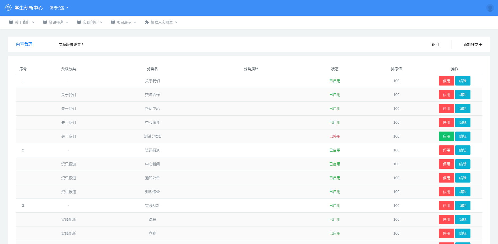
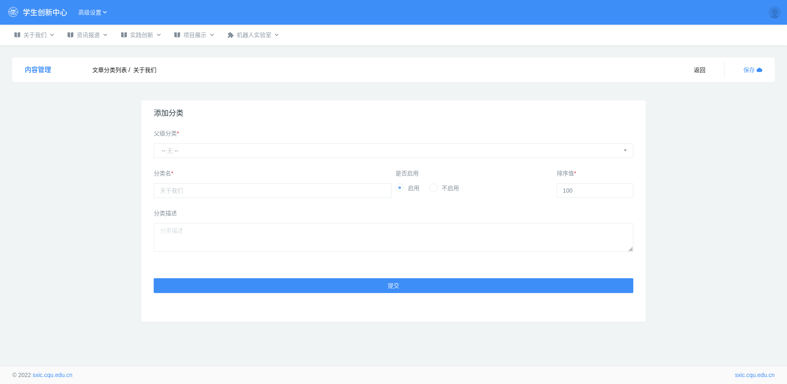
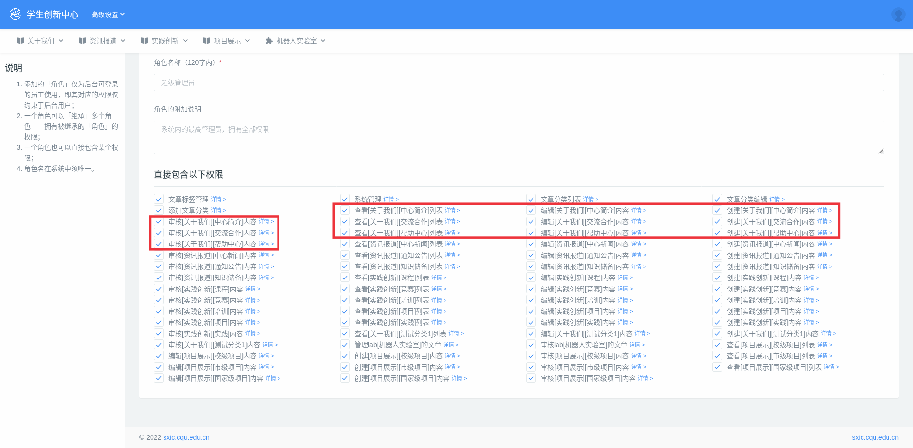
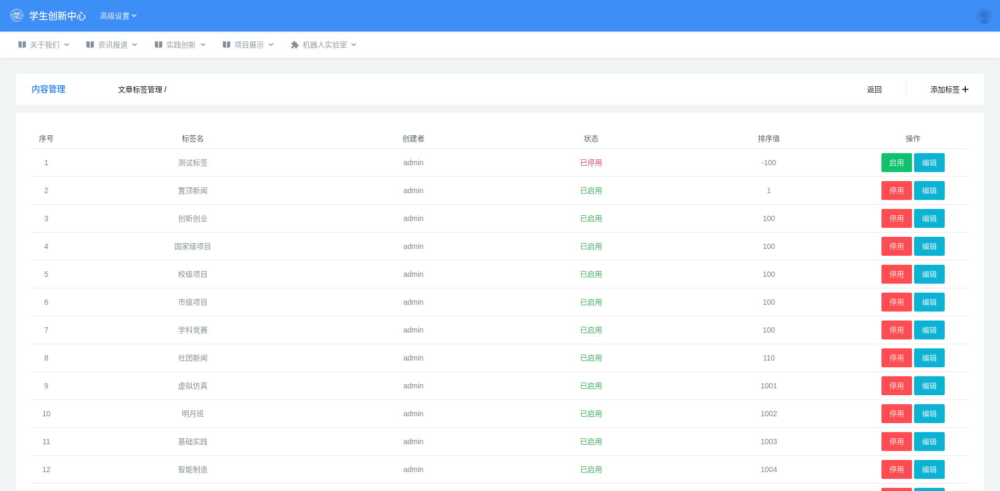
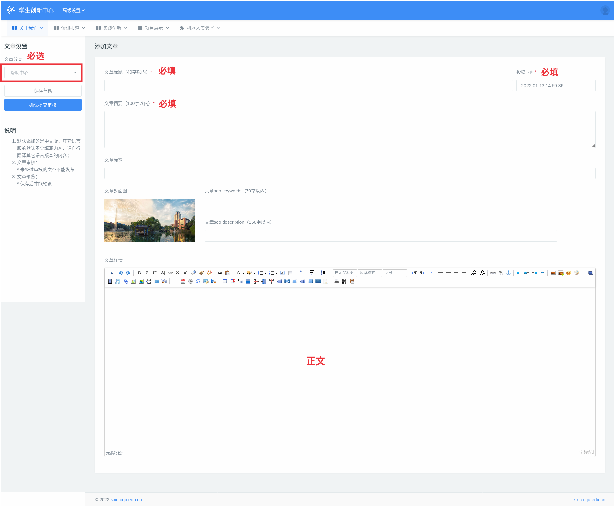
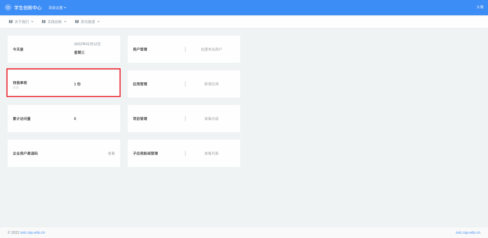
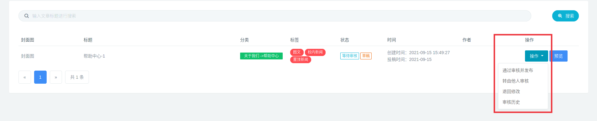

## 2.1 文章版块管理

所有以文章展示的版块都是文章版块，在后台的文章版块管理里面编辑该版块的名称、父级、排序等信息。

### 2.1.2 设置版块

路径：后台管理 --> 高级设置 --> 内容管理 --> 文章版块设置

点击 **编辑** 或者 **添加分类** 编辑/添加 版块。

如果填写父级分类则表示该版块添加到父级版块下的子版块里面，任一文章 **必须** 指定一个子版块才能发布。

父级分类的排序值只在父级分类里面生效，子级分类的排序值只在子级分类里面生效。（排序值越小越靠前）

> :warning: 添加文章版块后 **必须** 为该版块的管理员[设置相关权限](###设置权限)，才能进入版块设置内容。

### 2.1.3 设置权限

路径：后台管理 --> 高级设置 --> 管理员管理 --> 管理员权限管理

选择文章版块的 **创建、审核、查看、编辑**，该角色下的管理员就能对该版块下的文章进行 **创建、审核、查看、编辑**的操作。

> - 对于已存在的文章版块，设置好权限会立马生效；
> - **对新增的文章版块，设置好权限后，需要账号重新登录，该文章版块才会在后台导航菜单里面显示。**

### 2.1.4设置标签

编写文章时可选择添加文章标签，能添加的标签 **必须** 由管理员设置。（添加的标签数量不能超过 3 个）

设置路径：后台管理 --> 高级设置 --> 内容管理 --> 文章标签设置

### 2.1.5 添加文章

添加文章 **必须** 设置文章分类、文章标题、文章摘要、投稿时间。

文章标签 **只能** 设置管理员配置的标签。

如果写完不想提交审核或者临时离开文本编辑器，可以点击 **保存草稿** 临时存储文章。保存草稿需要填写必填的选项，保存后可以在该文章分类下查看。

文章确认无误后方可点击 **确认提交审核**，**选择管理员** 审核。

### 2.1.6 审核文章

管理员在后台首页可以看到 **待我审核** 栏需要审核的文章数量。

管理员可进行 **通过审核并发布、转由他人审核、退回修改** 操作，还能 **查看审核历史**。

