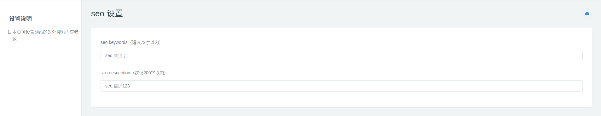
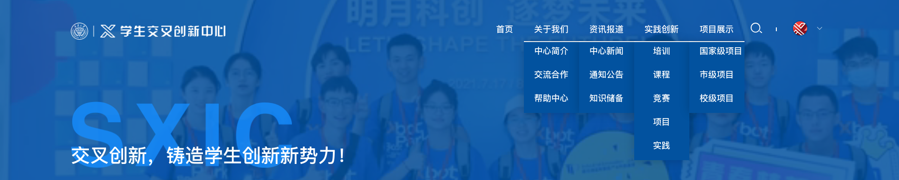
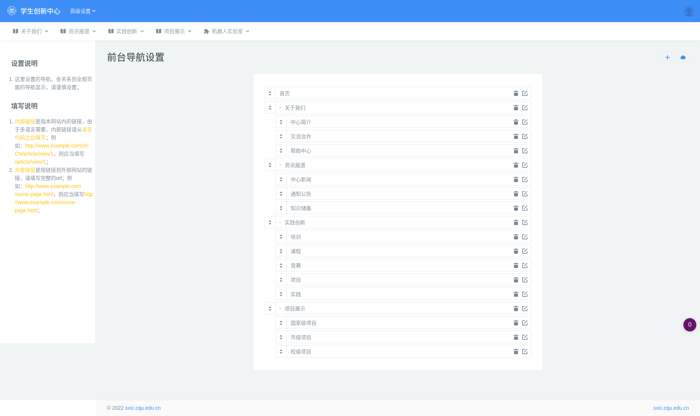
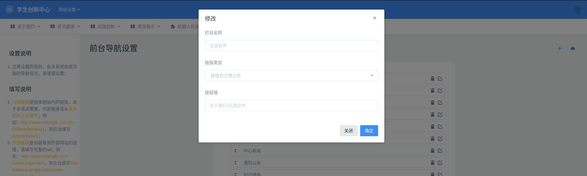
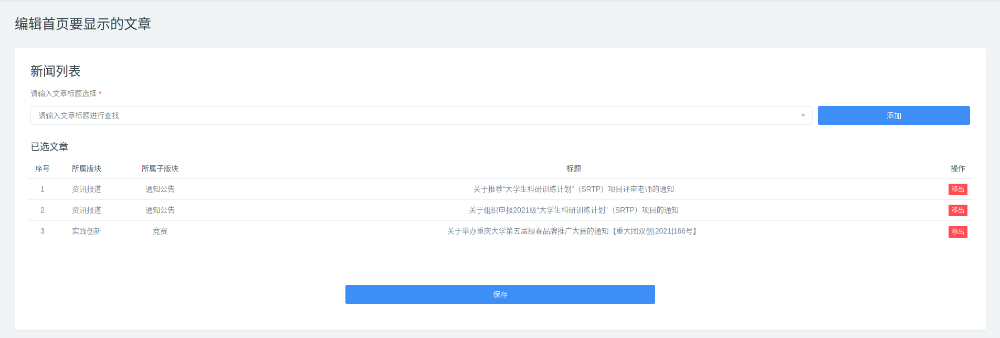
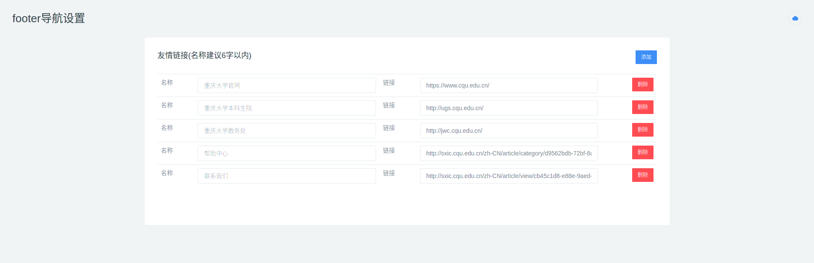

## 首页信息管理

设置首页信息包括了首页头部的背景、资源计数，展示的文章、Footer，导航栏条目、SEO 等信息。

### 头部资料编辑

头部资料包括 **背景、资源计数、sologan**。

设置路径：后台管理 --> 高级设置 --> 系统设置 --> 首页信息设置

- 背景以视频优先，如果没有视频则会显示图片。

### SEO

设置路径：后台管理 --> 高级设置 --> 系统设置 --> 站点参数设置

>  编辑完成后请点击保存（右上角的云朵标志）

### 首页前台导航栏

设置路径：后台管理 --> 高级设置 --> 系统设置 --> 前台导航设置

可以为导航条目设置跳转链接（请看 **填写说明**），也可以链接到文章、LAB。

选择链接类型为 **文章、LAB** 后，点击链接值填写框会显示可用选项。

> 编辑完成后请点击保存（右上角的云朵标志）

### 首页展示文章

这里的文章会首页的中心文章里面展示。

设置路径：后台管理 --> 高级设置 --> 系统设置 --> 首页文章设置

> 编辑完成后请点击保存

### 首页 Footer

设置路径：后台管理 --> 高级设置 --> 系统设置 --> footer设置

> 编辑完成后请点击保存（右上角的云朵标志）