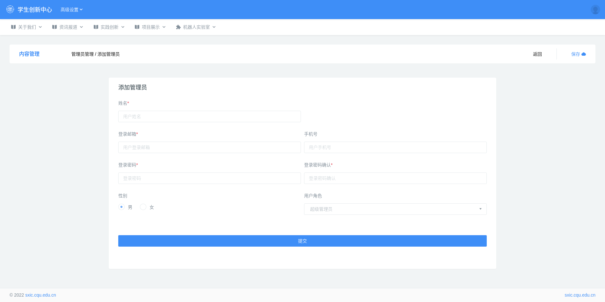

## 2.5 管理员管理

管理员按权限分为也分为不同的角色，具有最高权限的超级管理员、系统权限的系统管理员，拥有文章版块权限的版块管理员等。

### 2.5.1 创建管理员

创建路径：后台管理 --> 高级设置 --> 管理员管理 --> 创建管理员

**用户角色** 请查看下一章节的[角色管理](./role.md##角色管理)。

### 2.5.2 资料修改

管理员的资料修改同普通用户的资料修改。

路径：后台管理 --> 高级设置 --> 用户管理 --> 本站用户列表

点击管理员详情修改。