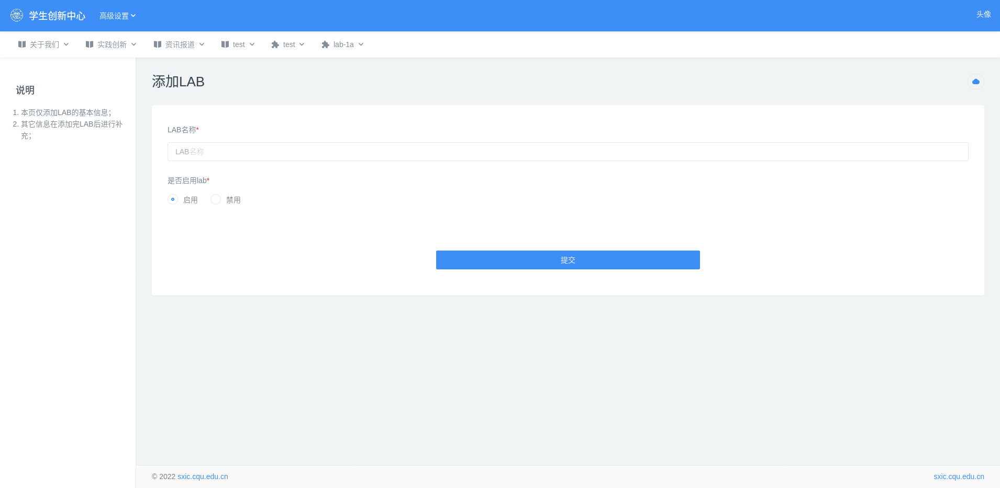

## 2.2 LAB 管理

Lab 代表实验室，每个 Lab 都是一个单独的页面，该页面包括头部资料（背景、slogan、资源计数）、设施与课程展示、教师列表、产业合作列表、lab 简介、lab 地址、联系老师等等。

### 2.2.1 添加 LAB

路径：后台管理 --> 高级设置 --> LAB 管理 --> 添加 LAB

该页面只设置了 Lab 的名称和是否启用，详细信息需要[设置 Lab 版块管理员](###设置权限)，然后由 Lab 版块的管理员来设置。

### 2.2.2 设置权限

路径：后台管理 --> 高级设置 --> 管理员管理 --> 管理员权限管理

选择 Lab 版块的 **创建、审核**，该角色下的管理员就能对该版块下的文章进行 **创建、审核** 的操作。

> - 对于已存在的 Lab 版块，设置好权限会立马生效；
> - **对新增的 Lab 版块，设置好权限后，需要账号重新登录，该 Lab 版块才会在后台导航菜单里面显示。**

### 2.2.3 编辑 LAB

设置权限重新登录后，导航菜单栏会显示该 Lab 版块。

点击 Lab 版块进入首页设置如下：

- 背景以视频优先，如果没有视频则会显示图片

### 2.2.4 创建文章

Lab 的文章会显示在前台 Lab 页面的中心要闻里面。

在后台导航菜单里面点击 Lab 版块 --> 新建文章，添加文章的细节请查看[添加文章](../admin/admin-article.md###添加文章)