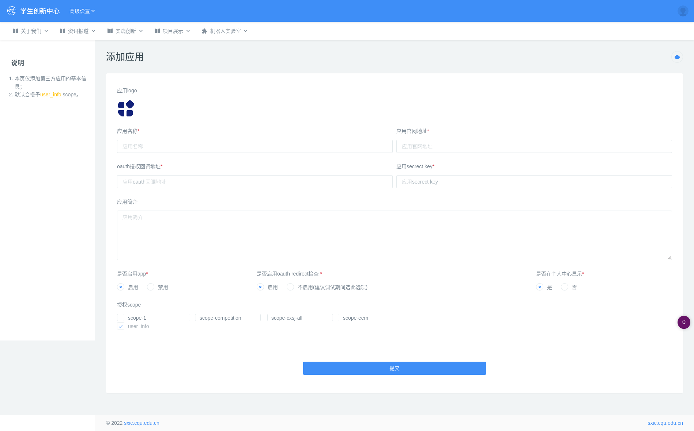
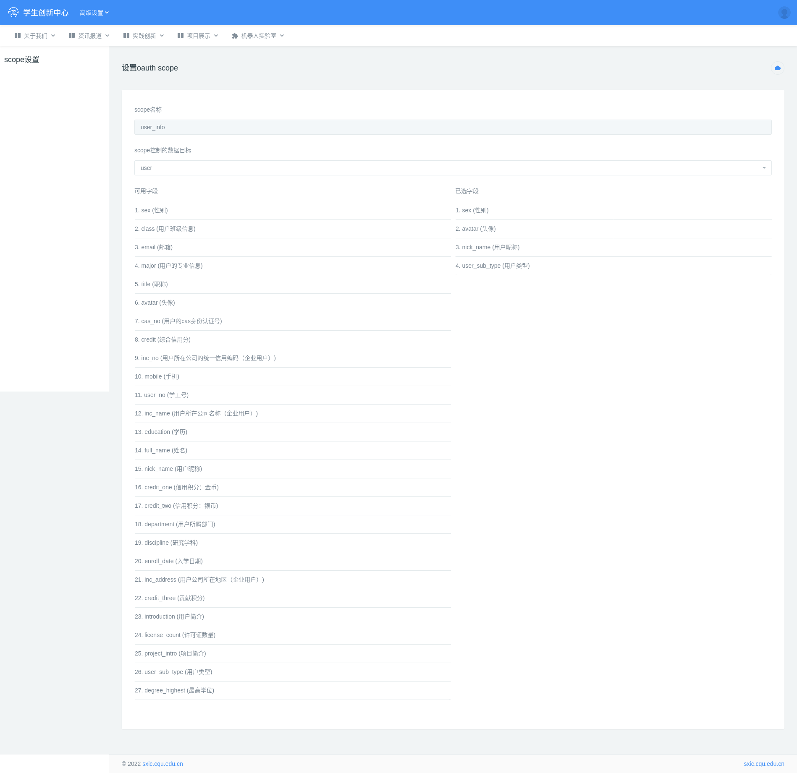

## 2.7 子应用管理

子应用类似小工具，用来延伸网站的用途，比如竞赛系统、智能制造服务中心等

### 2.7.1 添加子应用

路径：后台管理 --> 高级设置 --> 应用管理 --> 新添应用

#### 2.7.2 授权 scope

auth scope 代表授予子应用获取用户的信息范围，每个 scope 代表的含义请参考 [设置 oauth scope](###设置 oauth scope)。

> 请注意 user_info 是最基本的 scope，任一子应用都能获取最基本的 user_info

### 2.7.3 设置 oauth scope

路径：后台管理 --> 高级设置 --> 应用管理 --> oauth scope 设置

数据目标目前只有 user，点击可用的字段将字段添加进已选字段，点击已选的字段将字段移除已选字段。

设置完成后只需要在创建应用时授权该 scope 即可。

### 2.7.4 反查资料管理

子应用利用反查资料接口可以无权限直接获取到用户信息（通常用来获取查询用户是否存在）

可以设置子应用通过反查接口获取到的信息。

路径：后台管理 --> 高级设置 --> 应用管理 --> 应用列表 --> 反查资料接口

> :warning: 此接口容易被爆破出数据库的信息。