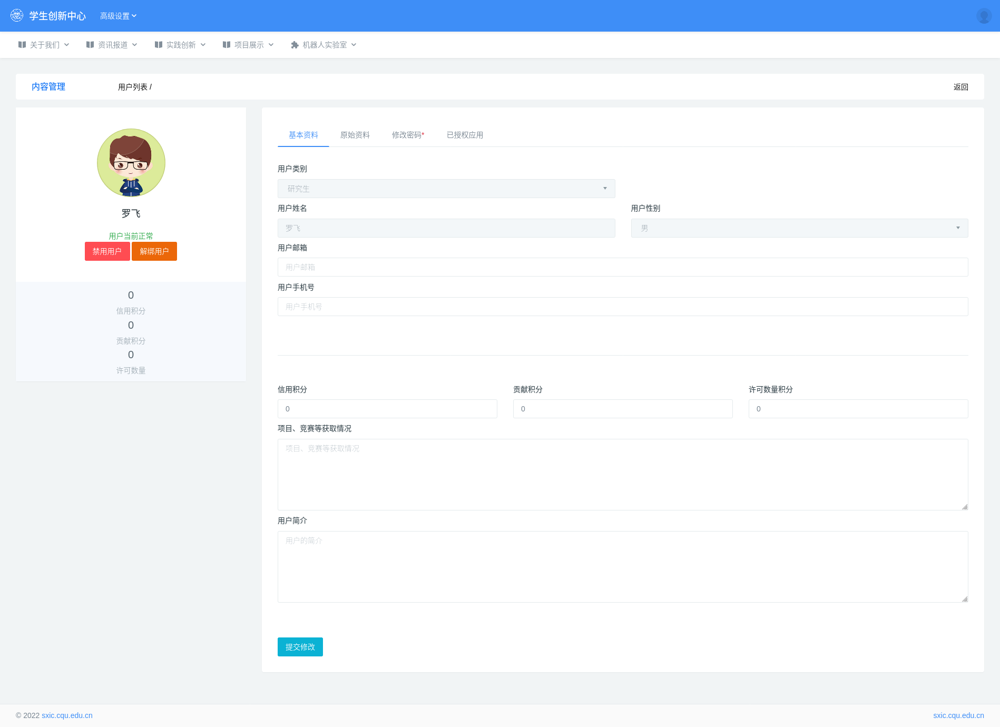

## 2.4 用户管理

目前管理员不能创建和删除老师、学生账号，只能修改账号的资料。

### 2.4.1 资料修改

管理员可以修改用户的邮箱、手机号、密码以及一些基础信息。

设置路径：后台管理 --> 高级设置 --> 用户管理 --> 本站用户列表 --> 详情

### 2.4.2 账户解绑、禁用

- 禁用：禁止用户使用该账号登录前台。
- 解绑：解除手机号、邮箱、微信等第三方账号的绑定。

### 2.4.3 企业用户

管理员可创建企业用户，也可以创建一个邀请码给企业自行创建。

> 一个邀请码只能使用一次

- 创建路径：后台管理 --> 高级设置 --> 用户管理 --> 创建企业用户

- 创建邀请码：后台管理 --> 高级设置 --> 用户管理 --> 企业邀请码

- 企业注册路径：前台 --> 登录 --> 注册