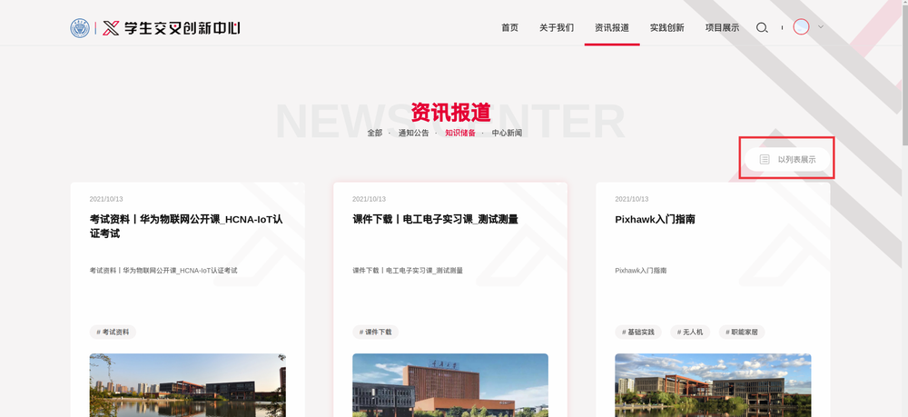
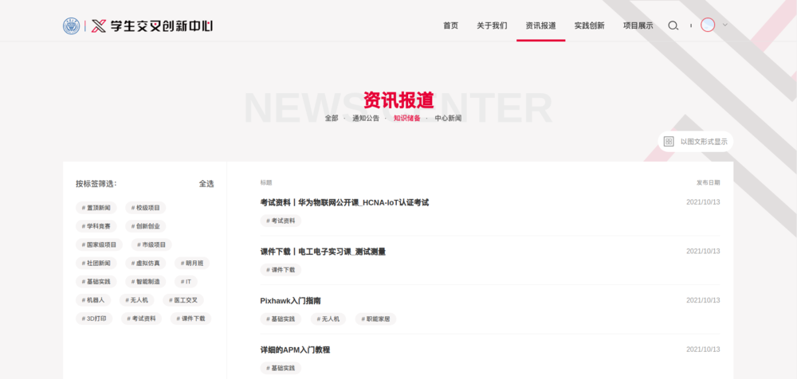
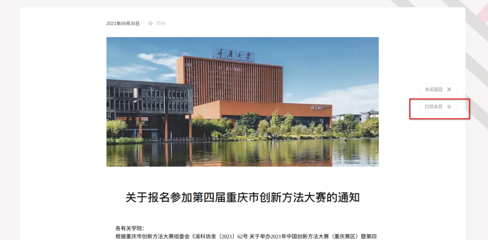

## 1.3 文章版块

导航栏的关于我们、资讯报道、实践创新、项目展示都属于文章版块。文章版块都有文章分类，文章列表和详情界面。

### 1.3.1 文章分类

所有的文章都在文章分类下面。

### 1.3.2 文章列表

文章列表可以默认使用网格的形式展示。点击 「**以列表展示**」使用列表展示。

### 1.3.3 文章详情

文章详情界面除了查阅该文章之外还可以 **打印** 该文章，阅读完文章后会展示 「**相关阅读推荐**」。

