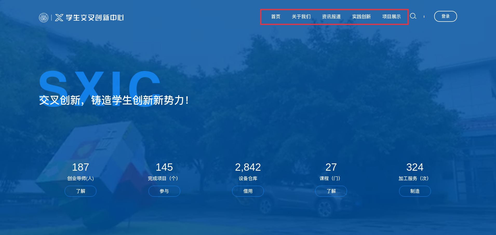
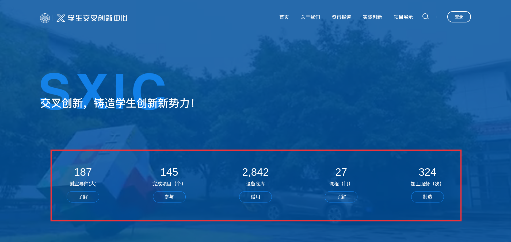
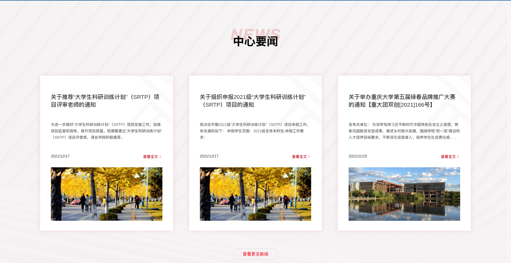
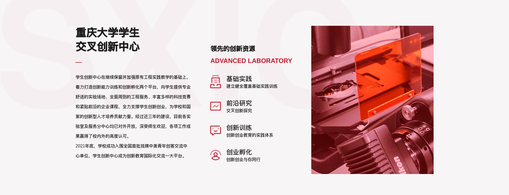
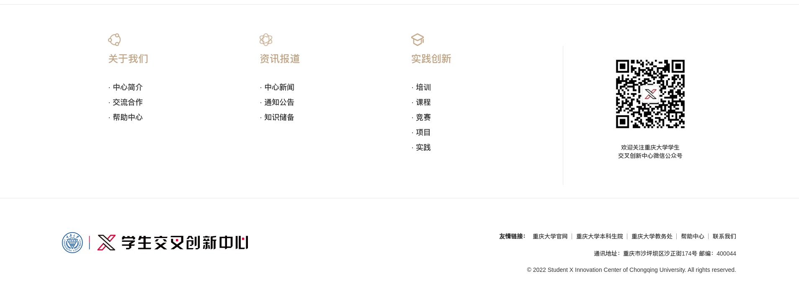

## 1.1 首页

首页展现了 **导航栏、资源计数、中心要闻、以及一些友情链接** 等信息。

### 1.1.1 导航栏

导航栏可以有文章版块、Lab 版块、以及一些外链，这些都可以在后台配置。

点击导航栏的内容可以前往该版块下查看所有相关内容。

每个文章版块都会有很多文章，滑动鼠标到导航栏版块上会显示下拉菜单，下拉菜单的各选项属于该版块的 **文章分类**。

例如下图：「实践创新」包括了「培训」、「课程」、「竞赛」等文章分类。

### 1.1.2 资源记数

资源记数的各项指标都可以在后台配置。

### 1.1.3 中心要闻

中心要文闻只展示 3 篇文章，需要在后台配置。

### 1.1.4 竞赛活动

竞赛活动其实也是一些文章，这些文章主要以竞赛类型为主，方便学生老师查看竞赛活动近况。

### 1.1.5 创新资源

### 1.1.6 Footer

Footer 主要列出了 **关于我们、咨询报道、实践创新** 3 个文章版块与其的子版块内容，右栏则展示了创新中心的二维码。最下面展示创新中心的 Logo 和友情链接。

Footer 下的 **友情链接** 可以在后台配置。