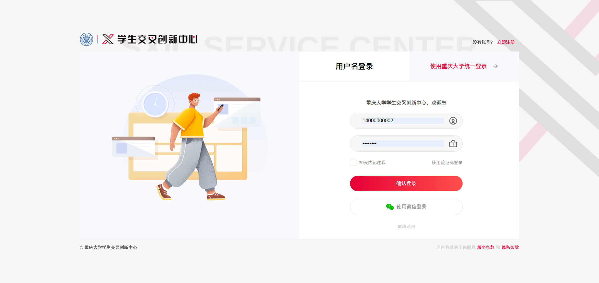
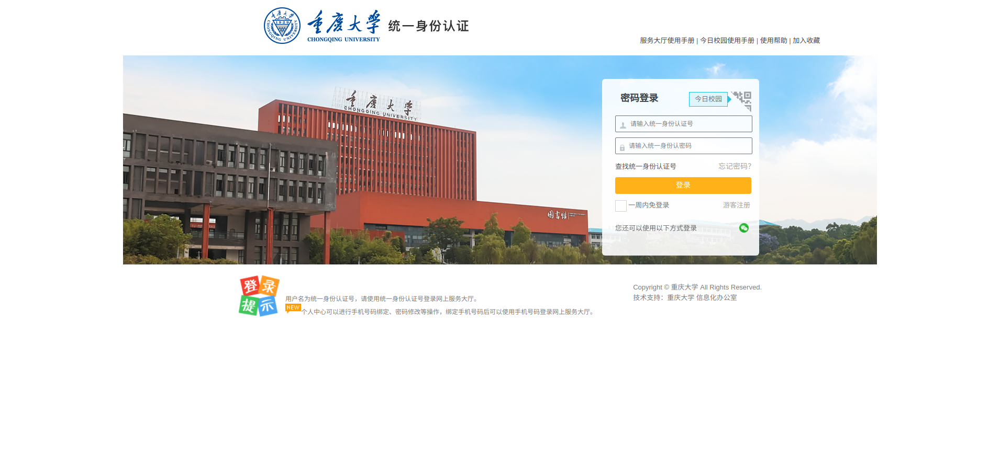
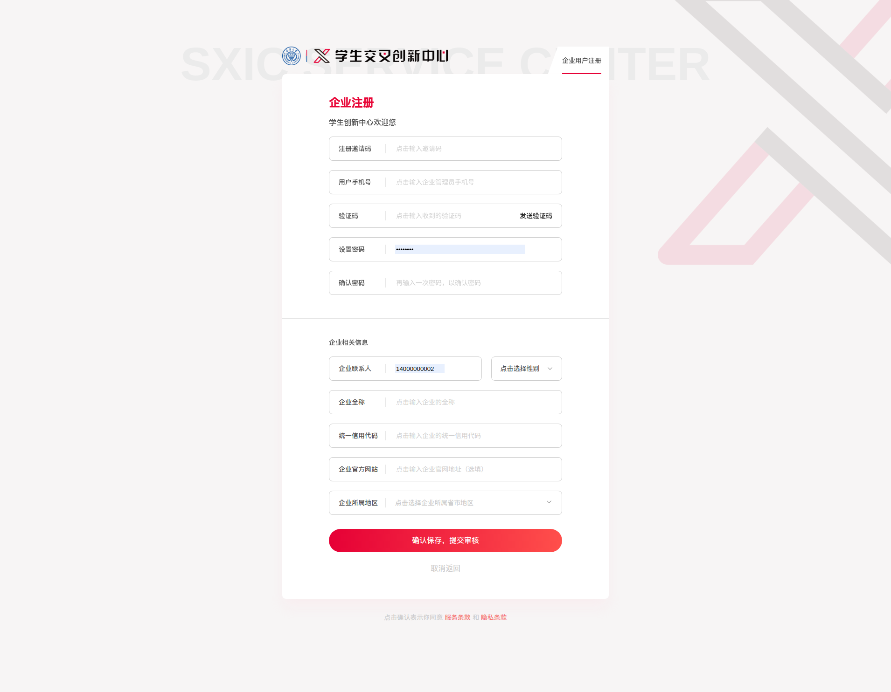
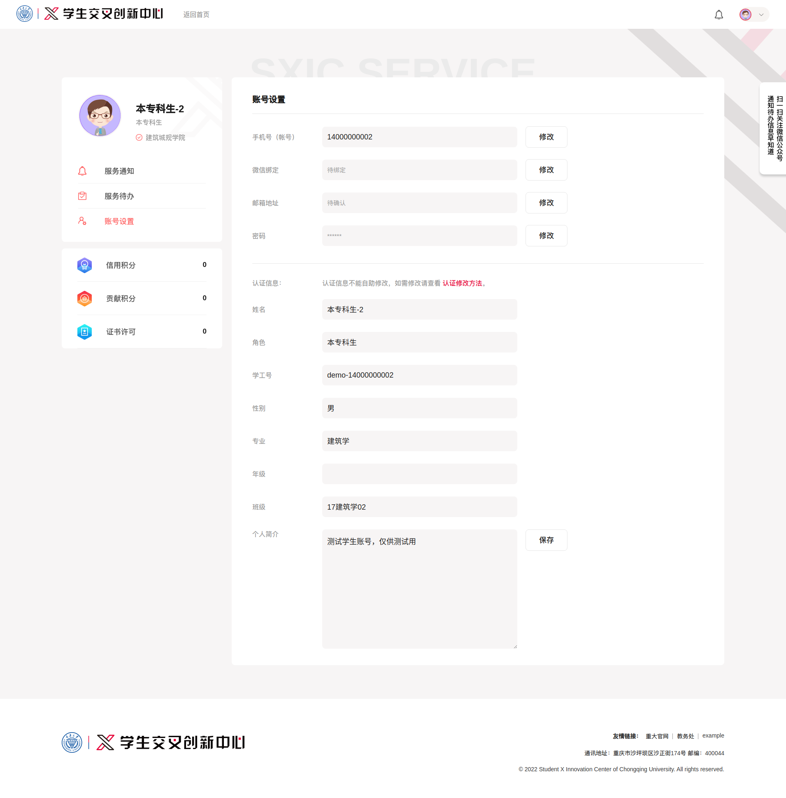
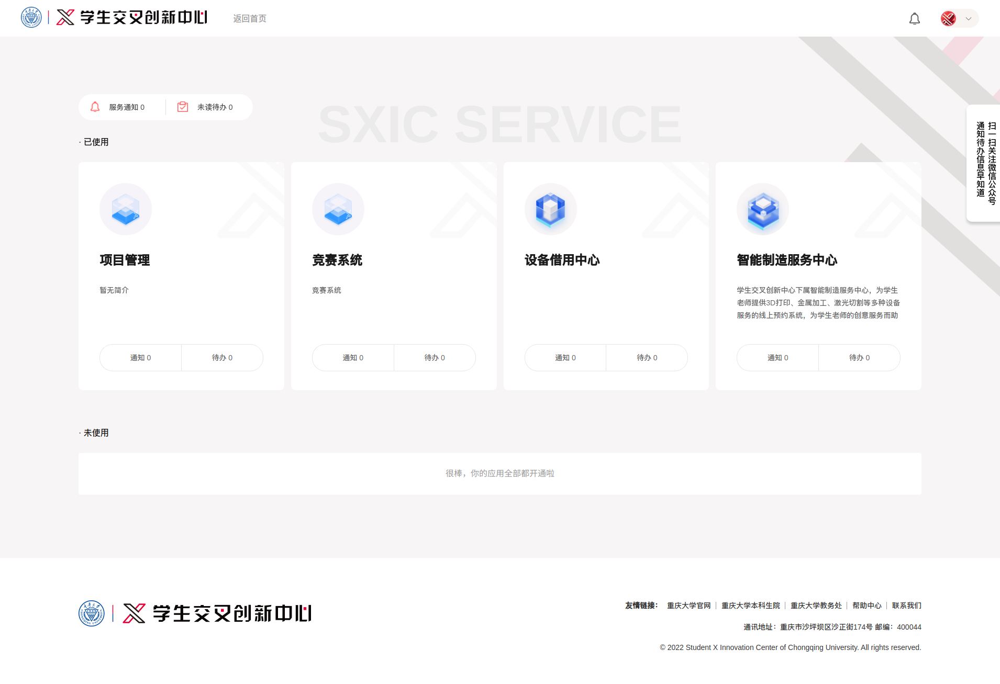

## 1.5 用户中心

用户登录后可以使用学生交叉创新中心下的子应用，接受子应用的服务通知。

### 1.5.1 账号密码登录

学生、老师可以使用 **后台管理员提供的账号密码** 登录学生交叉创新中心。

如果有绑定微信、手机号、邮箱则可以使用这些账号登录。

> 忘记密码请通知管理员修改密码。

### 1.5.2 CAS 登录

学生、老师也可以使用学校账号进行 CAS 登录（统一登录)。

### 1.5.3 企业登录

企业用户需要使用 **后台管理员提供的注册邀请码** 注册账户，管理员 **审核通过** 后才能登录。

### 1.5.4 账户设置

用户登录后可以在账户设置界面修改自己的账户信息。比如绑定手机号、微信、邮箱、密码等。

### 1.5.5 中心服务（授权应用）

用户可以在中心服务授权应用获取账户信息（在应用登录则默认同意授权），然后使用应用的相关服务。

